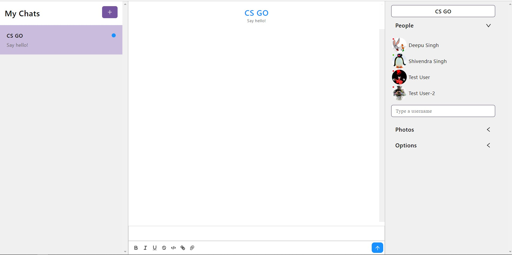

# ChatAppMod
LINK-https://github.com/Bluebird0223/ChatAppMod

### Test credentials

> Email: test@user.com<br/>
> Password: testUser<br/>

<br/>

> Email: test@user2.com<br/>
> Password: testUser2<br/>

<br/>

# 📸 Screenshots

## Home Page


<br/>
<br/>

## ✅ Requirements

Before starting you need to have [Git](https://git-scm.com) and [Node](https://nodejs.org/en/) installed.

<br/>
## 🔗 Run Locally

- Clone the project

```bash
  git clone https://github.com/Bluebird0223/ChatAppMod.git
  
```

- Go to the project directory

```bash
  cd Chat-application-using-React-JS
```

- Install dependencies

```bash
  npm install
```

- Start the server

```bash
  npm start
```

Note: <br/>
The page will reload if you make edits. <br/>
You will also see any lint errors in the console.

<br/>
